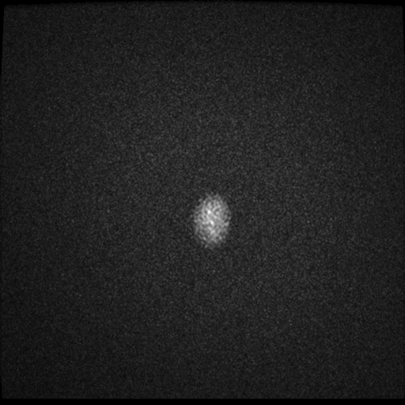
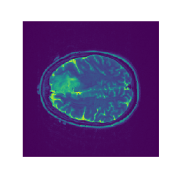

# Datasets
[TCIA Portal](http://www.cancerimagingarchive.net/)

## [Low Grade Glioma-LGG-1p19qDeletion](https://wiki.cancerimagingarchive.net/display/Public/LGG-1p19qDeletion)
- 159 patients with
  * T1, T2 MRI images: different patients may have different size of images.
  * NIfTI Segmentations: each patient has one T1.nii.gz file, one T2.nii.gz file and corresponding Segmentatuib.nii.gz file (all slices are 256x256)

### Files
- `/ssd/username/LGG-1p19qDeletion`: MR DICOM files.
- `/ssd/username/NiFTiSegmentationsEdited`: official segmentation of low glioma.
- `/ssd/username/image`: transformed npy files from T2.nii.gz file.
- `/ssd/username/label`: transformed npy files from Segmentation.nii.gz file.
- `/ssd/username/train.txt`: training set (80%, separated by patients).
- `/ssd/username/prediction.txt`: test set (20%, separated by patients).

### Example
  
<b>Figure 1: </b> A gif of dicom slices on T2 weighted scan from patient No.104.  

  
<b>Figure 2: </b> A nii image on T2 weighted scan from patient No.104.  

  
<b>Figure 3: </b> A nii segmentation image on T2 weighted scan from one patient No.104.  

### TODO:
- Run program on dicom images.

### Code to run the program

The following code focuses on nii images not dicom images.

Within the directory: /ssd/username/DM_calcification/original

THEANO_FLAGS="device=cuda0" python3 -u train.py /ssd/username/train.txt 256 alex_version3 > record.txt

# DICOM Geometry

[Coordinate Systems](https://www.slicer.org/wiki/Coordinate_systems)
[DICOM Fields](ftp://dicom.nema.org/MEDICAL/dicom/2015b/output/chtml/part03/sect_C.7.6.2.html)

- World coordinate: X = (x, y, z)
- ijk coordinate: i-column, j-row, k-slice.  Sort all dicoms by
  InstanceNumber and k is the 0-based index.
- World matrix (wm):     col(x, y, z, 1) = wm x col(i, j, k, 1)
- O = dcm.ImagePositionPatient: world coordinate of pixel (0,0)
- dirI, dirJ = dcm.dcm.ImageOrientationPatient: direction of first row
  and first column.
- spJ, spI = dcm.PixelSpacing
- i = dot(X-O, dirI) / spI
- j = dot(X-O, dirJ) / spJ

# Links
- [知乎: T1看解剖，T2看病变](https://www.zhihu.com/question/38567276/answer/152934823)

